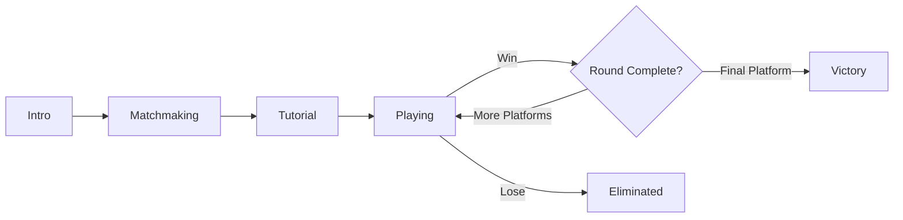

# 🎮 Lava Quest
> Unity clone of Royal Kingdoms' Lava Quest Event mechanic. A platform-hopping elimination game with state-driven flow and modern game architecture.

[](https://unity.com/)
[](https://docs.microsoft.com/en-us/dotnet/csharp/)

---

## Overview

LavaQuest is a Unity-based recreation of the popular elimination game mechanic from Royal Kingdoms. Players compete across multiple platforms, with each round eliminating competitors until only the victor remains. The project demonstrates modern Unity development practices, including state machine architecture, event-driven systems, and clean code design patterns.

### Key Features

- **State-Driven Gameplay** - Robust state machine managing game flow (Intro → Matchmaking → Tutorial → Playing → Round Complete/Victory/Eliminated)
- **Dynamic Matchmaking** - Animated player count system with visual avatars representing larger player pools
- **Smooth Animations** - DOTween-powered jump, fall, and idle animations with squash/stretch effects
- **Camera System** - Smooth camera transitions following platform progression
- **Audio Management** - Event-driven audio system with contextual sound triggers
- **Modular Architecture** - Clean separation of concerns using design patterns
- **ScriptableObject Configuration** - Data-driven design for easy game tuning

---

## Architecture

### Project Structure

```
Assets/_Game/Scripts/
├── Core/              # State machine, events, configuration
│   ├── GameStateMachine.cs
│   ├── IGameState.cs
│   ├── GameEvents.cs
│   └── GameConfig.cs
├── Controllers/       # Game logic controllers
│   ├── GameController.cs
│   ├── RoundController.cs
│   ├── AvatarController.cs
│   └── CameraController.cs
├── UI/                # State-based UI panels
│   ├── IntroPanel.cs
│   ├── MatchmakingPanel.cs
│   ├── TutorialPanel.cs
│   ├── PlayingPanel.cs
│   ├── RoundCompletePanel.cs
│   ├── VictoryPanel.cs
│   └── EliminatedPanel.cs
├── Gameplay/          # Core gameplay elements
│   ├── PlayerAvatar.cs
│   └── PlatformAnchor.cs
├── Data/              # ScriptableObject data assets
│   ├── LavaQuestConfig.cs
│   ├── AvatarData.cs
│   ├── AvatarDatabase.cs
│   └── AvatarAnimationConfig.cs
└── Audio/             # Audio management
    └── AudioManager.cs
```

### Game Flow

The state machine (`GameStateMachine`) orchestrates all game transitions:



1. **Intro** - Challenge info display, start button
2. **Matchmaking** - Animated player count (0→max), avatar slots, tap to continue
3. **Tutorial** - Instructions display, auto-transition delay
4. **Playing** - Main gameplay with win/lose mechanics
   - **Win:** Player + selected opponents jump to next platform, others fall/eliminate, camera follows
   - **Lose:** Player falls, others advance
5. **Round Complete** - Progress display, transition to next round
6. **Victory/Eliminated** - End screens with restart option

---

## Design Patterns

The project implements several industry-standard design patterns:

| Pattern | Implementation | Purpose |
|---------|---------------|---------|
| **State Pattern** | `GameStateMachine` + `IGameState` interface | Clean state management and transitions |
| **Observer Pattern** | `GameEvents` static class with C# events | Decoupled communication between systems |
| **Template Method** | `GameStatePanel` abstract base class | Common panel behavior with customizable hooks |
| **Command Pattern** | Event-driven requests via `GameEvents` | Action encapsulation (e.g., `RaiseWinRequested()`) |
| **Strategy Pattern** | Animation behaviors in `PlayerAvatar` | Interchangeable animation strategies (jump, fall, idle) |

---

## Systems

### Avatar System
- **AvatarController**: Spawns, positions, and manages avatar lifecycle
- **PlayerAvatar**: Jump/fall/idle animations powered by DOTween
- **PlatformAnchor**: Slot position management per platform
- **Fake Player Count**: Visual avatars represent larger player pool (configurable display count vs. matchmaking max)

### Animation System
- **DOTween-based** animations with smooth interpolation
- **Jump**: Squash/stretch effects with configurable height and duration
- **Fall**: Rotation, fade, and wobble effects for eliminated players
- **Idle**: Bouncing animations for waiting states

### Camera System
- **CameraController**: Smooth camera transitions following platform progression
- Configurable offset and duration for cinematic feel

### Audio System
- **AudioManager**: Event-driven sound triggers
- Contextual audio for game events (button clicks, victories, eliminations)

---

## Configuration

Game settings are managed through Unity ScriptableObjects for easy tuning:

- **LavaQuestConfig**: Platform count, matchmaking settings, animation timings
- **AvatarAnimationConfig**: Animation parameters (jump height, duration, etc.)
- **AvatarDatabase**: Avatar sprites and character data

---

## Technical Notes

- **Fake Player Count**: Visual avatars (configurable `displayAvatarCount`) represent a larger player pool (`matchmakingMaxPlayers`)
- **Elimination Rate**: Percentage of fake players eliminated per round (configurable)
- **Player Progression**: Player always advances on win (never randomly eliminated)
- **State Management**: Type-safe enum-based state system with interface-driven implementation

---

<div align="center">

⭐ Star this repo if you find it interesting!

</div>
